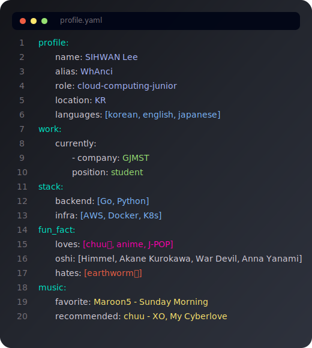

# Hey, there!
<picture>
  <source
    media="(prefers-color-scheme: dark)"
    srcset="svg/dark.svg"
  />
  <source
    media="(prefers-color-scheme: light)"
    srcset="svg/white.svg"
  />
  
</picture>

## Stats

